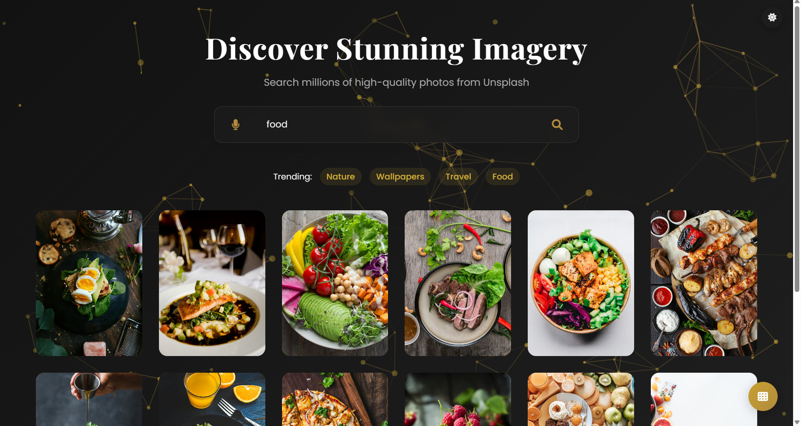

# 🌄✨ Image Search Engine ✨

### Discover breathtaking visuals with this cutting-edge image search tool! 🔍🎨

🌟 **Instant Results | Voice Search | Dark Mode | Stunning Animations** 🌟

---

## 🚀 Key Features

✅ **🎤 Voice Search** - Speak your queries effortlessly  
✅ **🌙 Dark/Light Mode** - Customize your experience  
✅ **🔮 Instant Suggestions** - Smart predictions for quick search  
✅ **📷 High-Quality Images** - Powered by Unsplash API  
✅ **📱 Responsive Design** - Seamlessly adapts to all devices  
✅ **🎬 Smooth Animations** - Engaging, fluid interactions  
✅ **🔁 Infinite Scrolling** - Load more images with ease  

---

## 📸 Screenshots

### 🏠 **Sleek Search Interface**



### 🌙 **Elegant Light Mode Grid View**


### 🌙 **Elegant Dark Mode List View**


### 🔍 **Crystal Clear Search Results**


---

## 🎥 Video Demo

📽️ https://github.com/dhanushrichandrasekar/imageSearchEngine/blob/ffc7cb3b10c42f0feed74aaabb796561378bcd99/searchEngineDemo.mp4

---

## 🛠 How It Works

### 🔍 1. Search for Images
💡 Type your query OR use voice search 🎤  
🔍 Get instant smart suggestions as you type  

### 🎨 2. Personalize Your Experience
🌗 Toggle between Dark/Light mode with one tap  
📱 Enjoy a fully responsive layout on any screen  

### ⬇️ 3. View & Download
🖱️ Hover over images for quick previews  
⚡ Download with a single click  

### 🔄 4. Explore More
🔁 Enjoy infinite scrolling with "Show More" for endless inspiration  

---

## 🔧 Technologies Used

### 🎨 Frontend Magic
- **🌍 HTML5** - Clean, semantic structure  
- **🎨 CSS3** - Eye-catching animations & responsive design  
- **⚡ JavaScript** - Dynamic & interactive features  

### 🔗 API Integration
- **📷 Unsplash API** - High-quality, royalty-free images  

### ✨ Special Features
- **🎤 Web Speech API** - Hands-free voice search  
- **🌌 Particles.js** - Dynamic interactive backgrounds  
- **💾 Local Storage** - Saves theme preferences  

---

## 📂 Project Structure

```
/imageSearchEngine
├── templates/
│   ├── imagesearchengine.html   # Main application file
│   ├── styles.css               # All styling
│   ├── script.js                # Core functionality
├── images/                      # Images and icons
│   ├── logo.png
├── screenshots/                 # Screenshots of image search engine
│   ├── ss1.png
│   ├── ss2.png
│   ├── ss3.png
│   ├── ss4.png
│   ├── ss5.png
│   ├── ss6.png
├── README.md                    # Documentation
└── imagesearchvid.mp4           # Demo video

---

## 🚀 How to Download & Run the Quiz  

### 📥 1. Cloning the Repository  
```bash
# Clone the repository from GitHub
git clone https://github.com/dhanushrichandrasekar/imageSearchEngine.git
```

---

### 📂 2. Navigating into the Project Folder  
```bash
# Move into the downloaded project folder
cd imageSearchEngine
```

---

### 🏁 3. Opening the Project  
```bash
# Open the project folder in VS Code (optional)
code .
```

- Locate **`imagesearchengine.html`** inside the templates folder.  
- Open it in any web browser (Chrome, Edge, Firefox, etc.).  

---

## 🌟 Unique Features  

✅ **🎤 Voice Search** - Speak instead of type with speech recognition  
✅ **🔮 Smart Suggestions** - Get instant predictions while typing  
✅ **🌙 Dark/Light Mode** - Customize your interface effortlessly  
✅ **🌌 Interactive Background** - Engaging animations with Particles.js  
✅ **📷 High-Quality Images** - Powered by Unsplash API  
✅ **🎮 Smooth Animations** - Enhancing user experience  
✅ **🔁 Infinite Scrolling** - Load more images dynamically  

---

## 💎 License  

This project is **open-source** and free to use for learning and development. 🚀  
Feel free to fork, modify, and contribute!  

---

## 👨‍💻 Author  

Developed with ❤️ by **Dhanushri C**  
📧 Email: dhanushri1702@gmail.com  
📌 GitHub: [Dhanushri Chandrasekar](https://github.com/dhanushrichandrasekar)  

---

🎉 **Happy Searching!** 📸✨🚀

